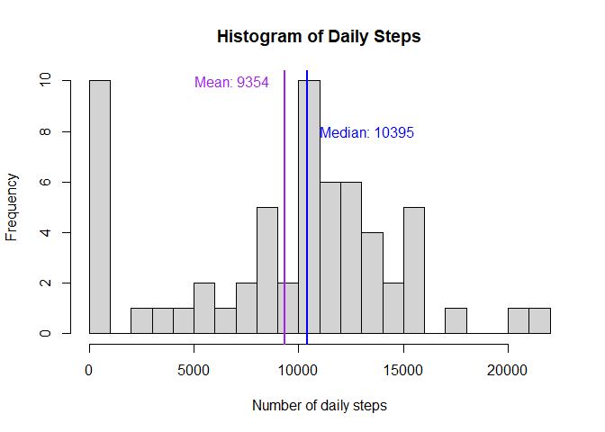
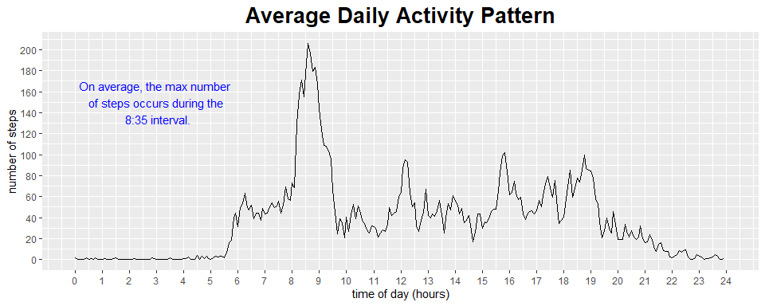
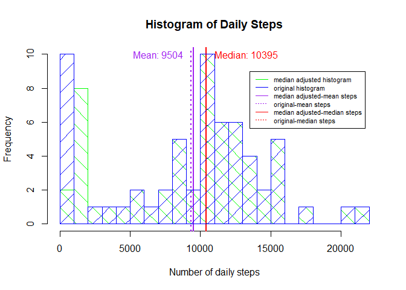
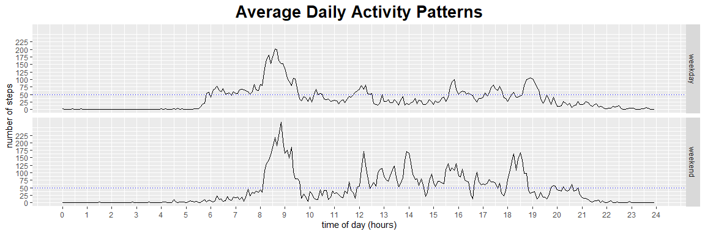

---
title: "Reproducible Research: Peer Assessment 1"
author: "Sarah Massengill"
date: "12/16/2020"
output: 
  html_document:
    keep_md: true
---
## Introduction to the project

This report makes use of data from a personal activity monitoring device. The
device collected data at 5 minute intervals through out the day between October 
and November 2012.  The data was provided by the instructors and was obtained by
forking the [project's GitHub branch](https://github.com/rdpeng/RepData_PeerAssessment1).

### Data

There are three variables:  
        1. **steps**: The number of steps taken in each 5 minute intervals.  When the
                  device did not take a measurement there is an NA entered.  
        2. **date**: The date that each measurement was taken in the form YYYY-MM-DD.  
        3. **interval**: Identifier for the 5 minute interval of the observation.  
        
There are a total of 17,568 observations in the dataset.


## Loading and preprocessing the data

The data is stored in the file *activity.zip*, and may need to be unzipped. A check
for the existence of *activity.csv* will determine if the file needs to be unzipped.
 
The data is read in by the *read.csv()* function and stored as a dataframe in the 
variable **activity**.  


```r
if (!file.exists("./data/activity.csv")){
        unzip("activity.zip",exdir="./data")
}
activity<-read.csv("./data/activity.csv")
```


Running a *str()* and *summary()* on the data will give more information 
about the dataset and help inform necessary steps needed to tidy the data.  


```r
str(activity)
```

```
## 'data.frame':	17568 obs. of  3 variables:
##  $ steps   : int  NA NA NA NA NA NA NA NA NA NA ...
##  $ date    : chr  "2012-10-01" "2012-10-01" "2012-10-01" "2012-10-01" ...
##  $ interval: int  0 5 10 15 20 25 30 35 40 45 ...
```

```r
summary(activity)
```

```
##      steps            date              interval     
##  Min.   :  0.00   Length:17568       Min.   :   0.0  
##  1st Qu.:  0.00   Class :character   1st Qu.: 588.8  
##  Median :  0.00   Mode  :character   Median :1177.5  
##  Mean   : 37.38                      Mean   :1177.5  
##  3rd Qu.: 12.00                      3rd Qu.:1766.2  
##  Max.   :806.00                      Max.   :2355.0  
##  NA's   :2304
```
The first step in tidying the data is to convert the **date** variable which is a 
character vector and then mutate it to a *Date class* using the lubridate
package's function *ymd()*. This new varialbe will is stored under the variable 
name **date.ymd**. 


```r
library(lubridate)
```

```
## 
## Attaching package: 'lubridate'
```

```
## The following objects are masked from 'package:base':
## 
##     date, intersect, setdiff, union
```

```r
library(dplyr)
```

```
## 
## Attaching package: 'dplyr'
```

```
## The following objects are masked from 'package:stats':
## 
##     filter, lag
```

```
## The following objects are masked from 'package:base':
## 
##     intersect, setdiff, setequal, union
```

```r
activity<-mutate(activity, date.ymd = ymd(date))
summary(activity)
```

```
##      steps            date              interval         date.ymd         
##  Min.   :  0.00   Length:17568       Min.   :   0.0   Min.   :2012-10-01  
##  1st Qu.:  0.00   Class :character   1st Qu.: 588.8   1st Qu.:2012-10-16  
##  Median :  0.00   Mode  :character   Median :1177.5   Median :2012-10-31  
##  Mean   : 37.38                      Mean   :1177.5   Mean   :2012-10-31  
##  3rd Qu.: 12.00                      3rd Qu.:1766.2   3rd Qu.:2012-11-15  
##  Max.   :806.00                      Max.   :2355.0   Max.   :2012-11-30  
##  NA's   :2304
```


The **interval** variable is a numeric data type and is a 1 to 4 digit integer. 
The values that are less than 4 digits are missing leading zeros.  Had all of 
the values been 4 digits, the first two digits would indicate the hour of the day
and the second two digits would indicate the minutes past the hour in which the 
5 minute interval started. The hours were measured using a 24 hour clock format: 
first hour of the day is hour = 0, and the last hour of the day is hour = 23. 
An interval value of 0 means 0:00, the first 5 minute interval of the day and 
2305 is 23:05 the last of the day. 

The interval variable needed to be transformed into a usable form but a deliminator 
between the hour and minute values is necessary to use the lubridate package's 
*hm()* function.  Dividing by 100 and rounding to two decimal places allows 
for the *hm()* function to parse the times correctly. This creates a period class 
vector saved under the name **time.hms**. 

For plotting ease a variable **time.of.day** is added as the numerical number of
hours since the start of the day. The lubridate package has the *hour()* and 
*minute()* functions to parse the hour and minutes of a period class variable.


```r
## creating the time.hms variable
activity$time.hms <- with(activity, hm(round(interval/100,2)))

##creating the time.of.day variable
activity<-mutate(activity,time.of.day = hour(time.hms)+minute(time.hms)/60) 
summary(activity)
```

```
##      steps            date              interval         date.ymd         
##  Min.   :  0.00   Length:17568       Min.   :   0.0   Min.   :2012-10-01  
##  1st Qu.:  0.00   Class :character   1st Qu.: 588.8   1st Qu.:2012-10-16  
##  Median :  0.00   Mode  :character   Median :1177.5   Median :2012-10-31  
##  Mean   : 37.38                      Mean   :1177.5   Mean   :2012-10-31  
##  3rd Qu.: 12.00                      3rd Qu.:1766.2   3rd Qu.:2012-11-15  
##  Max.   :806.00                      Max.   :2355.0   Max.   :2012-11-30  
##  NA's   :2304                                                             
##     time.hms            time.of.day    
##  Min.   :0S            Min.   : 0.000  
##  1st Qu.:5H 58M 45S    1st Qu.: 5.979  
##  Median :11H 57M 30S   Median :11.958  
##  Mean   :11H 57M 30S   Mean   :11.958  
##  3rd Qu.:17H 56M 15S   3rd Qu.:17.938  
##  Max.   :23H 55M 0S    Max.   :23.917  
## 
```


With the addition of **date.ymd**, **time.hms**, and **time.of.day**, **date** and **interval** are no longer necessary.  To save space these variables willbbe removed to form a tidy dataset that will allow for ease of further analyses.  


```r
## remove date and interval columns
activity <- select(activity, -date, -interval)
str(activity)
```

```
## 'data.frame':	17568 obs. of  4 variables:
##  $ steps      : int  NA NA NA NA NA NA NA NA NA NA ...
##  $ date.ymd   : Date, format: "2012-10-01" "2012-10-01" ...
##  $ time.hms   :Formal class 'Period' [package "lubridate"] with 6 slots
##   .. ..@ .Data : num  0 0 0 0 0 0 0 0 0 0 ...
##   .. ..@ year  : num  0 0 0 0 0 0 0 0 0 0 ...
##   .. ..@ month : num  0 0 0 0 0 0 0 0 0 0 ...
##   .. ..@ day   : num  0 0 0 0 0 0 0 0 0 0 ...
##   .. ..@ hour  : num  0 0 0 0 0 0 0 0 0 0 ...
##   .. ..@ minute: num  0 5 10 15 20 25 30 35 40 45 ...
##  $ time.of.day: num  0 0.0833 0.1667 0.25 0.3333 ...
```
## What is mean total number of steps taken per day?

For this initial part of the project missing values, marked as NA, will be ignored.

To answer this sections question activity will be grouped by day (**date.ymd**), 
and then the steps are summed for each group/day.  Then the mean and median steps in
a day can be calculated.  Below is the code to carry out these calculations and 
plot a histogram of the data.    


```r
# group by date
act.day <- group_by(activity, date.ymd)

# sum steps for each day
daily.steps <- summarize(act.day, steps = sum(steps, na.rm = TRUE))
```

```
## `summarise()` ungrouping output (override with `.groups` argument)
```

```r
# calculate the mean and median daily steps
mean.daily.steps <- mean(daily.steps$steps)
median.daily.steps <-median(daily.steps$steps)

# plot a frequency histogram for the daily steps
hist(daily.steps$steps,breaks = 20, xlab = "Number of daily steps", 
     main = "Histogram of Daily Steps")

# add line indicating the mean and the median and label them
abline(v = mean.daily.steps, col="purple", lwd = 2)
abline(v = median.daily.steps, col = "blue", lwd = 2)
text(x = c(mean.daily.steps-2500,median.daily.steps+2900), 
     y = c(10,8), col = c('purple', 'blue'),
     label=c(paste("Mean:", as.character(round(mean.daily.steps))),
             paste("Median:",as.character(median.daily.steps))))
```

<!-- -->

```r
#print out the mean and median values
print(paste0("The mean daily steps: ",
             as.character(mean.daily.steps)))
```

```
## [1] "The mean daily steps: 9354.22950819672"
```

```r
print(paste0("The mean daily steps: ",
             as.character(median.daily.steps)))
```

```
## [1] "The mean daily steps: 10395"
```


## What is the average daily activity pattern?

To calculate the average daily activity pattern the activity dataset needs to be 
grouped by **time.of.day**.  Then the mean number of steps for each 5 minute time 
interval starting at **time.of day** is calculated. Using the ggplot2 package, the 
average daily activity pattern can be graphed by plotting the average number of 
steps taken with respect to the time of day.


```r
library(ggplot2)

## group by time of day
act.time <- group_by(activity, time.of.day)

## create a human readable time of day vector            
times = unique(with(act.time, paste0(as.character(hour(time.hms)),
                                     ":",as.character(minute(time.hms)))))

## find the mean number of steps taken for each 5 minute time interval
mean.daily.act <- summarize(act.time, mean.steps = mean(steps, na.rm = TRUE),
                            median.steps = median(steps, na.rm = TRUE)) 
```

```
## `summarise()` ungrouping output (override with `.groups` argument)
```

```r
## Calculate the maximum number of steps and the time in which it occurs
idx.max = mean.daily.act$mean.steps == max(mean.daily.act$mean.steps)
time.max = times[idx.max]
steps.max = mean.daily.act$mean.steps[idx.max]

## Create the graph with the labels and annotations
g <- ggplot(data = mean.daily.act, aes(x= time.of.day, y = mean.steps)) +
     geom_line(aes(group=1))+ 
     labs(title="Average Daily Activity Pattern",
          y = "number of steps",
          x = "time of day (hours)") +
     theme(plot.title = element_text(hjust = 0.5, size = 20, face = "bold"),
           legend.position="none") +
     annotate("text",colour = 'blue', x= 3, y = 150, 
              label = paste("On average, the max number \nof steps occurs during the\n",
                            as.character(time.max),"interval.")) +
     coord_cartesian(xlim=c(0,24)) +
     scale_x_continuous(breaks=seq(0,24,1))+
     scale_y_continuous(breaks=seq(0,210,20))


g
```

<!-- -->


## Imputing missing values

Method for replacing missing values: Replace the NA's with the median of the 
non-missing step-values for the same interval of time stored in the variable
**time.of.day**. 

The mean of the time period skewed towards outliers, so median seemed the better
choice. 

The mean and median number of steps for each interval were recorded in the data
frame **mean.daily.act**.  These values are merged with the **activity** dataframe to 
create **act.noNA** data frame.  

The *is.na()* can be used on the **steps** variable to locate all the row values with
NA entries.  Then those rows with NA's are filled with the row's median value that
cooresponds to the time of day, and this creates the *median adjusted* data set.    


```r
## Add the mean and median number of steps for each time period
act.noNA<-merge(activity,mean.daily.act,by="time.of.day")

## Find all indices where steps == NA
idx.na <- is.na(act.noNA$steps)

## count the NA's and print result
num.na <- sum(idx.na)
print(paste0("The total number of NA entries: ",as.character(num.na)))
```

```
## [1] "The total number of NA entries: 2304"
```

```r
## Replace each NA with the median value that corresponds to the time of day
act.noNA$steps[idx.na] <- round(act.noNA$median.steps[idx.na])

## group by date adn summarize the number of steps taken in a day
act.noNA <- group_by(act.noNA,date.ymd)
daily.steps.noNA <- summarize(act.noNA, steps = sum(steps, na.rm = TRUE))
```

```
## `summarise()` ungrouping output (override with `.groups` argument)
```

```r
## Calculate the mean and median after using the median adjustment
mean.daily.noNA <- mean(daily.steps.noNA$steps)
median.daily.noNA <-median(daily.steps.noNA$steps)

## create a histogram of the number of steps in a day and compare
## it with the previous histogram by plotting them together in different colors
hist(daily.steps.noNA$steps,breaks = 20, col = 'green',
     angle=135, density = 5,
     xlab = "Number of daily steps", 
     main = "Histogram of Daily Steps")
## Add dotted lines of the previous mean and median
abline(v = mean.daily.steps, col="purple", lwd = 2, lty = 3)
abline(v = median.daily.steps, col = "red", lwd = 2, lty = 3)

## add solid lines of the new adjusted mean and median
abline(v = mean.daily.noNA, col="purple", lwd = 2)
abline(v = median.daily.noNA, col = "red", lwd = 2)
text(x = c(mean.daily.noNA-2500,median.daily.noNA+2900), 
     y = c(10,10), col = c('purple', 'red'),
     label=c(paste("Mean:", as.character(round(mean.daily.noNA))),
             paste("Median:",as.character(median.daily.noNA))))
legend(x = 13500, y = 9,col=c("green", "blue", "purple","purple","red","red"), 
       lty=c(1,1,1,3,1,3), 
       legend=c("median adjusted histogram","original histogram",
                "median adjusted-mean steps", "original-mean steps",
                "median adjusted-median steps", 'original-median steps'),
       cex = .7 )

## print out the mean and median values
print(paste0("The mean daily steps after median adjusting the NA values: ",
             as.character(mean.daily.noNA)))
```

```
## [1] "The mean daily steps after median adjusting the NA values: 9503.86885245902"
```

```r
print(paste0("The mean daily steps after median adjusting the NA values: ",
             as.character(median.daily.noNA)))
```

```
## [1] "The mean daily steps after median adjusting the NA values: 10395"
```

```r
hist(daily.steps$steps,breaks = 20, add = TRUE, col = "blue", density = 5)
```

<!-- -->


## Are there differences in activity patterns between weekdays and weekends?

To look at the average daily patterns for the weekend and weekdays separately two 
new variables are added: **day.of.week**, **day.end**. The first calculates the day of 
from the **date.ymd**, and the second uses the day of the week to classify each observation
as either a week*end* or a week*day*.  With these new variables the whole data 
frame can be grouped first by *day.end* and then by **time.of.day**.  And the average 
daily activity pattern can be calculated as before.  A horizontal reference line at 50 steps 
per interval is added as well to help see that on the weekday the individual gets
moving earlier than on the weekend, but more activity occurs throughout the day 
and continues later on in the night on the weekend. 


```r
## Add day of week variable, and weekday/end factor variable
act.week.day.end <-mutate(activity, day.of.week = wday(date.ymd),
                          day.end = cut(day.of.week, 
                                        breaks = c(0,5,7), 
                                        labels = c("weekday", "weekend")))

## group and calculate the mean steps for each time interval
act.week.day.end <-group_by(act.week.day.end,day.end,time.of.day)
ave.daily.steps<- summarize(act.week.day.end, mean.steps = mean(steps, na.rm = TRUE))
```

```
## `summarise()` regrouping output by 'day.end' (override with `.groups` argument)
```

```r
## Plot the two line graphs and add the reference line
g2 <- ggplot(data = ave.daily.steps, aes(x= time.of.day, y = mean.steps))+ 
      facet_grid(day.end~.)+
      geom_line(aes(group=1)) +
      geom_hline(yintercept = 50,color="blue", linetype = "dotted") +
      labs(title="Average Daily Activity Patterns",
           y = "number of steps",
           x = "time of day (hours)") +
      theme(plot.title = element_text(hjust = 0.5, size = 20, face = "bold"),
            legend.position="none") +
      coord_cartesian(xlim=c(0,24)) +
      scale_x_continuous(breaks=seq(0,24,1))+
      scale_y_continuous(breaks=seq(0,225,25))
g2
```

<!-- -->
